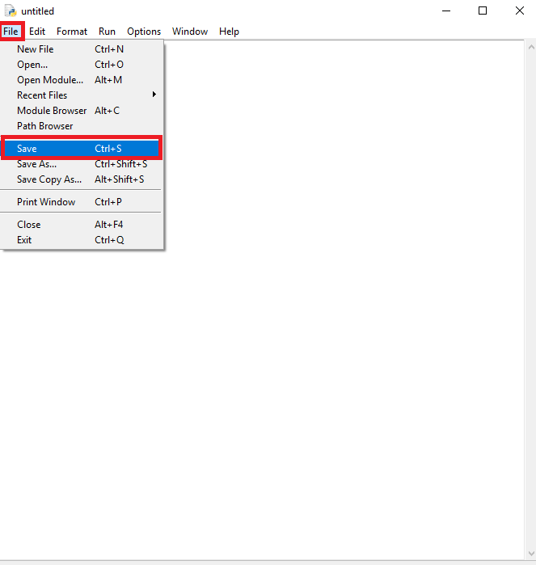
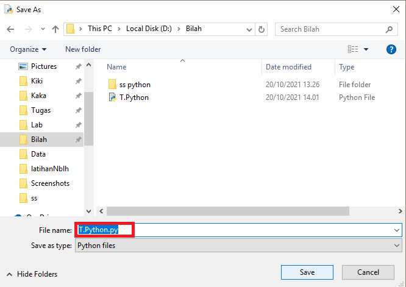
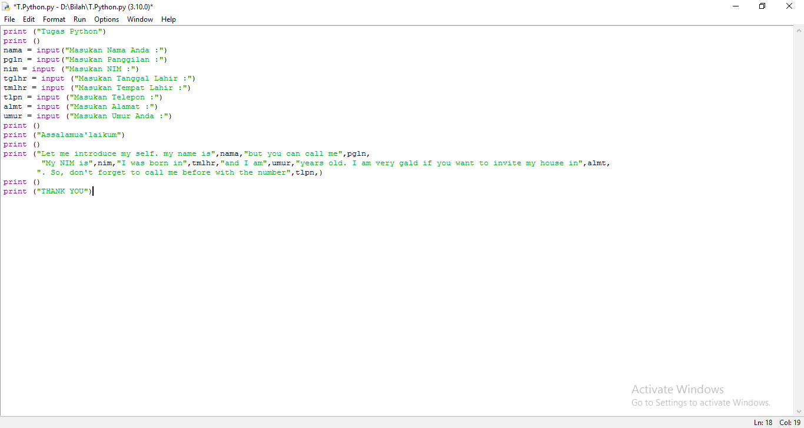
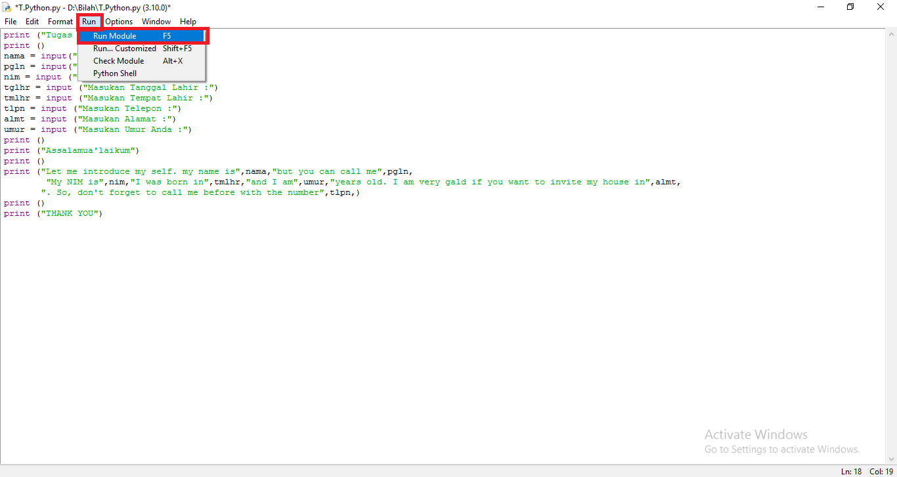
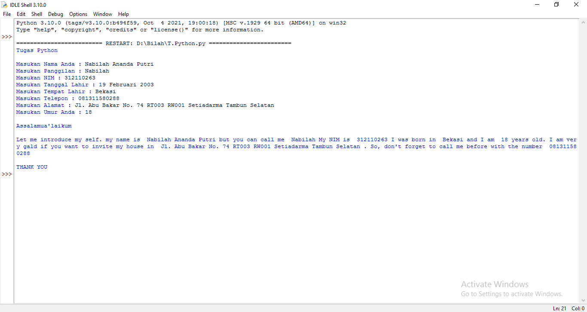

# Latihan_Python

## Instalasi Python
Download Python terlebih dahulu, di website resmi [Python](https://www.python.org/)

# Cara Input Menggunakan Python
- Buka IDLE Python di pencarian


)
- Kemudian klik 
```bash
> File
> New File
```


- Setelah itu klik
```bash
> File
> Save
```



- Untuk menyimpan file Python
```bash
> "JANGAN LUPA MENGGUNAKAN .py"
```



- Masukan koding yang kalian ingin gunakan



- Kemudian klik Run untuk menjalankan program
```bash
> Run
> Run Module
```



# Output



- Selesai

## Terima Kasih